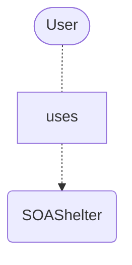
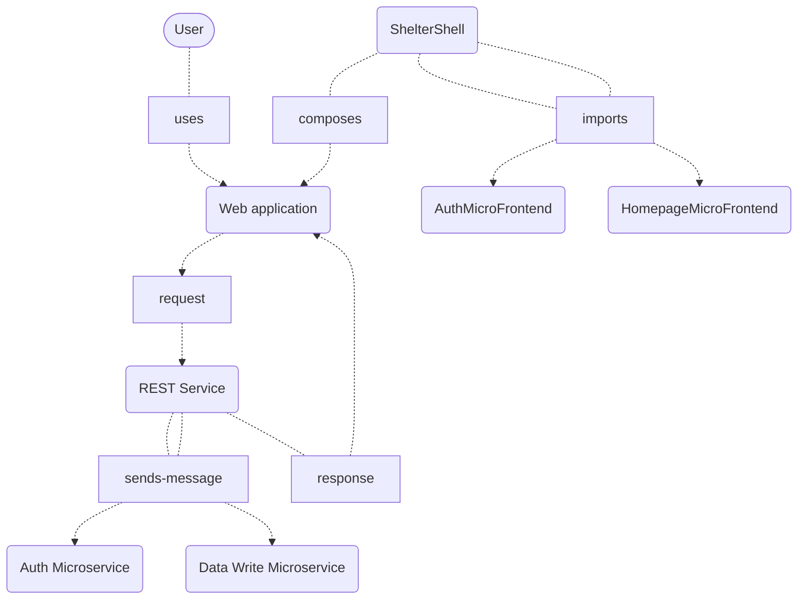
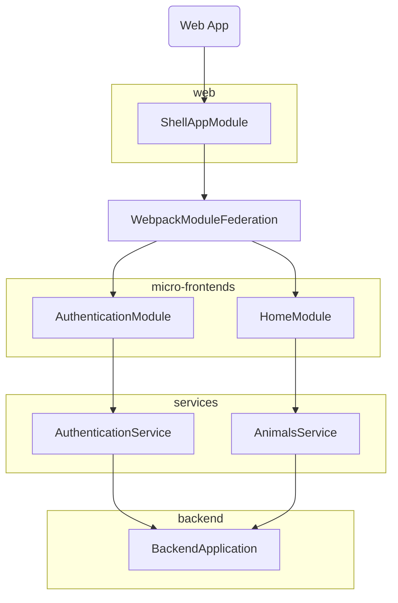
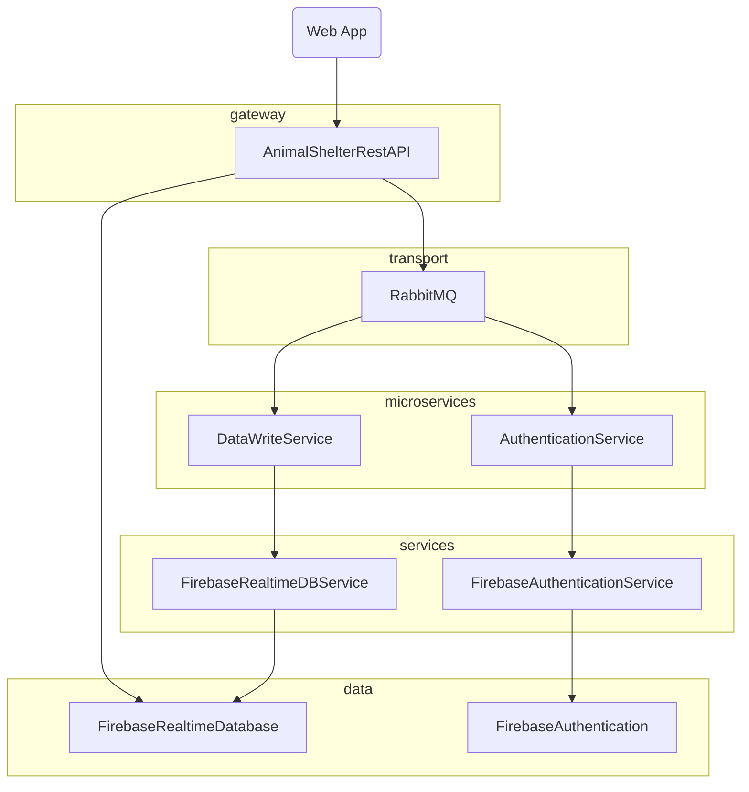
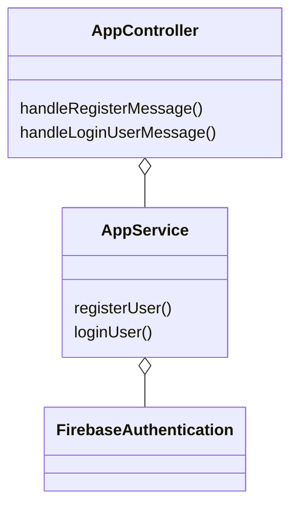
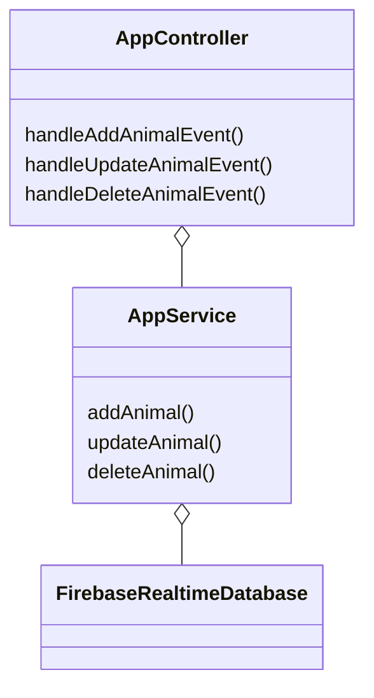

# SOAShelter
SOAShelter is an example project for demonstration of microservices and microfrontends that manages adoption of pets from a shelter

## Description

### The Back-end
The back-end portion of the project is composed of multiple NestJs services. 
The animal-shelter-client service acts as a http gateway that interfaces with the front-end.
The animal-shelter-authentication service is a microservice that handles authentication tasks.
The animal-shelter-animals service is a microservice that handles write operations on the animal database.
The Nest services communicate through RabbitMQ.
The backend services use Firebase Authentication and Firebase Realtime-Database as the data layer.
### The Front-end
The front-end is composed of three angular applications, animal-shelter-mainfe acts as the shell project and using webpack module federation imports the exposed modules from the animal-shelter-authentication(FE) and animal-shelter-home applications that expose the authentication pages and the home page respectively.

## Installation

For the back-end, 
A docker container hosting all the necessary images for the services can be created
from the root of the repository:
```bash
docker compose up
```

For the front-end client run each app
```bash
cd frontend/animal-shelter-mainfe
npm install
npm start
```
```bash
cd frontend/animal-shelter-home
npm install
npm start
```
```bash
cd frontend/animal-shelter-authentication
npm install
npm start
```

The frontend applications also contain dockerfile configurations to be ran in a container, but running them on my system was not possible due to the large size of the applications.
## Structure
Because Github does not render mermaid diagrams, I have added images for easier reading without the need to clone in the readmeimages folder.

### System Context Diagram

### Container Diagram


### Component Diagram Front-end

### Component Diagram Back-end

### Code AuthenticationMicroservice


### Code DataWriteMicroservice

